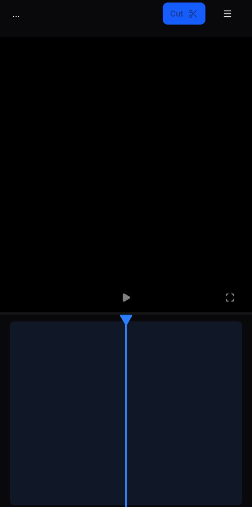
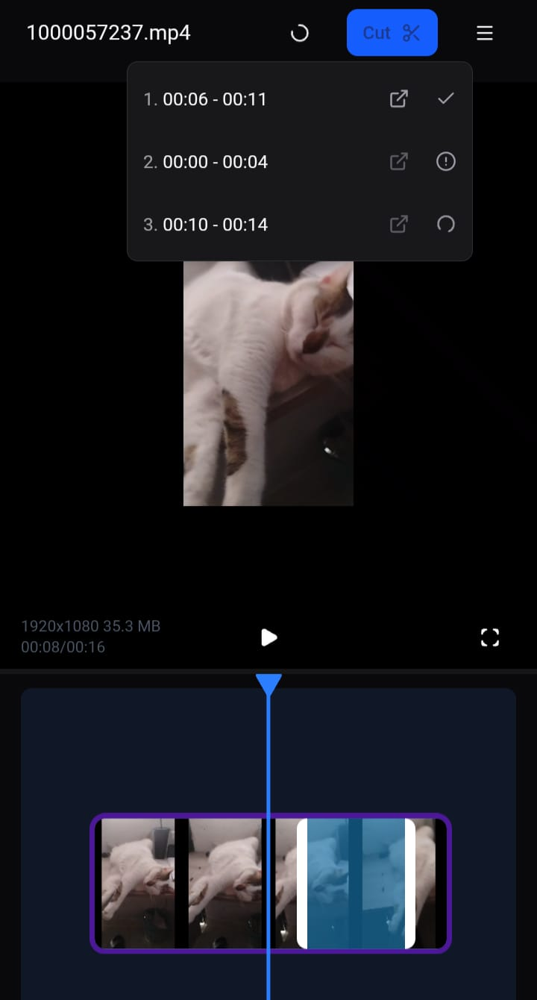
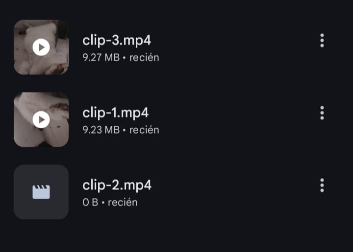

<p align="center">
  
</p>

<h1 align="center">BlogCutter</h1>

<p align="center">
  Fast & non-blocking video cutter for Android
</p>

<p align="center">
  
  
  
</p>

---

## ✂️ What is BlogCutter?

**BlogCutter** is an Android application designed to **quickly cut long videos into multiple clips** with a single click.

Its main advantage is a **non-blocking workflow**:  
you can create a new cut immediately while previous cuts are still being processed.

This makes it ideal for fast content creation and repetitive clipping tasks.

---

## 🚀 Key Features

- 🎬 One-click video cutting  
- ⚡ Non-blocking processing (cuts run in parallel)  
- 🔁 Create multiple cuts without waiting  
- 📂 All clips are stored automatically in a folder  
- 🔢 Clips are saved **in creation order**  
- 🧠 Simple and efficient workflow  

---

## 🧪 Project Status

> ⚠️ **Demo / Functional Prototype**  
> This project is intended to demonstrate the concept and processing workflow.  
> It is not a full-featured professional video editor.

---

## 📦 Download

You can download the demo APK from the **Releases** section:

```text
https://github.com/Bastiasa/blogcutter/releases
```

> Android may show a warning when installing APKs from unknown sources.  
> This is expected for demo applications.

---

## 🖼️ Screenshots

<p align="center">
  
  
  
</p>

---

## 🛠️ Built With

- Android Studio  
- Java / Kotlin  
- Local video processing  
- Android Storage APIs  

---

## 🧠 What This Project Demonstrates

- Concurrent background processing  
- Non-blocking UI design  
- Efficient file management  
- Fast interaction-driven workflows  
- Clean and simple app logic  

---

## 📂 Output Organization

All generated clips are automatically saved in a dedicated folder.  
Files are ordered based on the sequence in which the cuts were created, making them easy to use or upload later.

---

## ❌ Known Limitations

- No advanced editing features (filters, transitions, audio tools)  
- Basic UI focused on functionality  
- Not optimized for tablets  
- No automated tests included  

---

## 👤 Author

Developed by **Luis Bastidas**  
- Portfolio: https://bastiasa.github.io/portfolio

---

## 📄 License

This project is licensed under the **MIT License**.

---

## ⭐ Notes

If you find this project useful or interesting, feel free to star the repository.